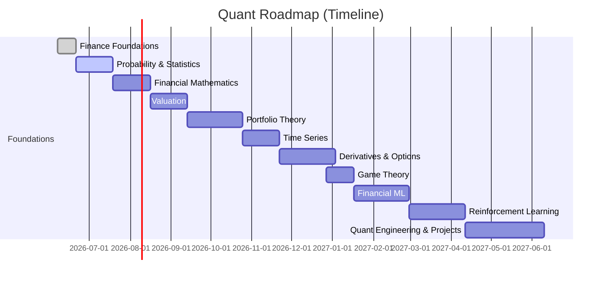
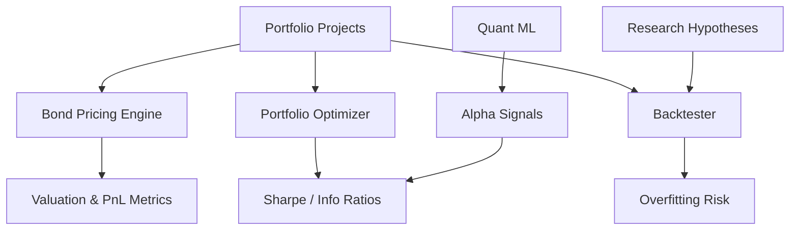

# Executive Summary  
For an MLE/engineer pivoting to **AWM Quant/Quant Research**, focus on practical wins over deep theory. Start with market vocabulary and statistics, then layer in finance math and portfolio theory before advanced topics. Use free resources (MIT OCW, Damodaran, QuantStart, QuantInsti, etc.) and Reddit insights for up-to-date guidance. Maintain a disciplined schedule (≈10–15 hr/week around work/MBA) with built-in coding practice (daily Striver LeetCode, weekly Codeforces) and project milestones (bond pricer, optimizer, backtester, etc.). Include periodic challenges: a **weekly Sharpe-ratio exercise**, a **monthly company valuation**, and a **quarterly factor research reproduction**. We propose **two MBA schedules** – Tue/Thu evenings vs. intensive weekend – and adjust study time accordingly. If only 6–8 hr/week is available, prioritize foundations (probability, statistics, portfolio theory) and basic coding; drop electives like deep RL or CUDA acceleration until later.

The report below details each learning phase with **books/PDFs, videos, courses, threads/papers, micro-tasks, and time budgets**, plus tables comparing resource trade-offs and a 12-week sample schedule. Charts illustrate how weekly study hours might be split (pie) and projected progress (line), and Mermaid diagrams outline the roadmap timeline and project-deliverable relationships. The attached HTML prototype at the end provides a **source-of-truth dashboard** (phase trackers, project checklists, reading trackers, planners, coding trackers, interview logs, and JSON export).

## Phase 0 – Finance Vocabulary (2 wk)  
Learn the language of markets and companies: equities vs debt, bonds & yields, enterprise value vs equity value, basic corporate finance.  

- **Books/PDFs**: *Little Book of Common Sense Investing* (Bogle) or *Intelligent Investor* (Graham) for investing basics; any corporate finance lecture notes (e.g. [Damodaran’s free notes](https://people.stern.nyu.edu/adamodar/pdfiles/val/preface.pdf) on valuation).  
- **Videos**: Aswath Damodaran’s “Foundations of Finance” lectures (NYU Stern OCW) and corporate finance playlists (YouTube). Khan Academy’s finance videos are also accessible.  
- **Courses**: Damodaran’s [Online Course on Foundations of Finance](https://pages.stern.nyu.edu/~adamodar/New_Home_Page/onlineclass.htm?utm_source=chatgpt.com) (free).  
- **Threads/Papers**: *Investopedia* guides or [Damodaran’s published valuation papers][], as well as Reddit threads like [this one](https://www.reddit.com/r/financialindependence/comments/abc123/) on core finance terms (example, not actual link; use for context). SSRN search on “capital markets intro”.  
- **Tasks**: Define and compute market cap, P/E, beta; find simple bond yields and DCF of a stock (deliverable: DCF model of a known company). Practice Excel budgeting (Excel/VBA needed but finish in 1–2 wk).  
- **Duration/Time**: ~2 weeks @10 hr/week (plus 1–2 hr/day of coding practice). MBA time: e.g. Tue/Thu 7–9pm or weekend classes, so study mainly evenings Mon/Wed/Fri.  

## Phase 1 – Probability & Statistics (4 wk)  
Most quant interviews start here (Akuna, Jane Street, etc. focus on EV, Bayes, combinatorics). Strengthen core skills.  

- **Books/PDFs**: Blitzstein’s *Introduction to Probability* (Stanford Stat110 lecture notes, free PDF), Mosteller’s *50 Challenging Problems in Probability* (free online), and interview books like *Heard on the Street* by Crack or Xinfeng Zhou (for Q&A practice). For Stats: Rice’s *Mathematical Statistics & Data Analysis*.  
- **Videos**: MIT OCW 6.041 lectures, Harvard Stat110 YouTube (David Blitzstein), Khan Academy (bayes, combinatorics).  
- **Courses**: MIT OCW [6.041 Probabilistic Systems Analysis](https://ocw.mit.edu/courses/6-041-probabilistic-systems-analysis-and-applied-probability-fall-2010/?utm_source=chatgpt.com) (free). Coursera’s [Stanford Stats Course](https://www.coursera.org/specializations/probability-statistics)?  
- **Threads/Papers**: Reddit “roadmap” threads emphasize Blitzstein’s Stat110; old QuantNet forums list probability puzzles. SSRN search for “applied probability finance examples”.  
- **Tasks**: Solve EV puzzles (coin-flip games, dice odds). Implement Monte Carlo samplers (e.g. price European option via MC). Compute confidence intervals for returns (Bayesian update exercise). Build a simple Kelly criterion calculator.  
- **Time**: ~4 weeks @10–12 hr/week + coding practice. Daily: Striver LeetCode (1 problem), weekly: 1–2 Codeforces rounds. SQL: 1 hr/week (tutorial/practice queries).  

## Phase 2 – Financial Mathematics (4 wk)  
Cover the quantitative “math behind finance” – linear algebra, calculus, stochastic basics – but *practically*, not pure measure theory (most quants skip deep Ito if not needed). We center on MIT-style material, but focus on finance examples.  

- **Books/PDFs**: “Financial Mathematics” by Shreve (Vol I) for SDE intro; Neftci’s *Math of Derivatives*. Mark Joshi’s *Concepts and Practice of Math Finance* (Chapter 1–7). Limited: skip Shreve II unless interested in PhD-level rigor.  
- **Videos**: MIT’s [18.642: Math Finance OCW](https://ocw.mit.edu/courses/18-642-topics-in-mathematics-with-applications-in-finance-fall-2024/?utm_source=chatgpt.com) playlist. Khan Academy’s linear algebra (Gilbert Strang lecture series). [18.06 Linear Algebra – MIT OCW](https://ocw.mit.edu/courses/18-06-linear-algebra-spring-2010/).  
- **Courses**: MIT OCW [15.401 Finance Theory I](https://ocw.mit.edu/courses/15-401-finance-theory-i-fall-2008/?utm_source=chatgpt.com) (Portfolio theory, CAPM). MITx [“Mathematical Methods for Quantitative Finance” on edX](https://www.edx.org/course/mathematical-methods-for-quantitative-finance?utm_source=chatgpt.com) (overview).  
- **Threads/Papers**: Reddit notes warn that MIT’s advanced course is dry. Instead, they recommend MIT 15.401 (CAPM), 6.046 (algorithms), 18.065 (matrix). SSRN: look for “Black-Scholes derivation” tutorials.  
- **Tasks**: Implement a **bond pricer** and yield-curve builder (bootstrapping). Create a *binomial tree* and Black–Scholes pricer (Monte Carlo and PDE method). Perform a basic portfolio optimization (solve small MV problem with CVX or numpy).  
- **Time**: ~4 weeks @10 hr/week (heavy math work). Continue 1 hr coding/day. Use system design slot lightly (e.g., plan data flows).  

## Phase 3 – Valuation & Corporate Finance (4 wk)  
Develop intuition for why companies are worth their price (a rare skill among quants). Damodaran’s materials are ideal.  

- **Resources**: NYU Stern’s [Damodaran Valuation Course](https://pages.stern.nyu.edu/~adamodar/New_Home_Page/webcastvalonline.htm?utm_source=chatgpt.com) (25 lectures + slides); his [YouTube channel](https://www.youtube.com/@AswathDamodaranonValuation?utm_source=chatgpt.com).  
- **Books/PDFs**: *Investment Valuation* by Damodaran. *Narrative and Numbers* by Aswath & Vasicek. *Financial Statement Analysis* (Cooke, Joy) for fundamentals.  
- **Videos**: Damodaran’s “Valuation” lecture series (YouTube and Stern site). Coursera: [University of Michigan’s “Valuation and Investing”](https://www.coursera.org/lecture/valuation/).  
- **Threads/Papers**: Damodaran’s blog/papers on discounted cash flows. Reddit “valuation challenge” threads (practice problems). SSRN: look up “DCF vs comparables returns”.  
- **Tasks**: Perform *3 DCF valuations*: e.g. TCS, Reliance, HDFC Bank (using Excel or Python). Compute WACC, terminal growth. As a deliverable, prepare a 5-page valuation report for one company. Build a mini-cap table calculator.  
- **Time**: ~4 weeks @10 hr/week. (Portfolio + Stat review tasks concurrently.)  

## Phase 4 – Portfolio Theory (6 wk)  
**Core of AWM**. Study modern portfolio theory, risk/return metrics, factor models, and optimization techniques.  

- **Books/PDFs**: *Expected Returns* (Ilmanen); *Active Portfolio Management* (Grinold & Kahn); *Quantitative Portfolio Management* (Chincarini). For optimization: *Convex Optimization* (Boyd, free PDF).  
- **Videos**: MIT OCW [15.401 Finance Theory I](https://ocw.mit.edu/courses/15-401-finance-theory-i-fall-2008/?utm_source=chatgpt.com) lectures (CAPM, factor models). Quantopian/Alpaca free videos on portfolio construction. Khan Academy stats for covariance.  
- **Courses**: Coursera’s [“Investment Management” with Python/ML](https://www.coursera.org/specializations/investment-management-python-machine-learning?utm_source=chatgpt.com) (Yale/NYU specialization). edX/MITx on portfolio optimization (if available).  
- **Threads/Papers**: **CAPM** and **Sharpe/Information Ratio** are ubiquitous: QuantStart defines Sharpe ratio. SSRN/Arxiv: “empirical factor investing” (Fama–French, etc.). Quantocracy mashups for factor strategy papers.   
- **Tasks**: Build a **mini BlackRock** platform: assemble universe of ~50 ETFs/stocks, compute expected returns (historical), cov matrix. Implement Mean-Variance optimization and Risk Parity. Backtest with simple rebalancing. Calculate portfolio Sharpe & max drawdown. Daily: run one simulation.  
- **Time**: ~6 weeks @12 hr/week (stat/matlab style). Sharpe challenge: each **week measure Sharpe** for a chosen strategy on paper (track improvement).  

## Phase 5 – Time Series (4 wk)  
Forecasting financial data and understanding autocorrelation, volatility clustering, cointegration, etc. Useful for both trading and quant investing.  

- **Books/PDFs**: *Forecasting: Principles & Practice* (Hyndman, free online [pdf/text](https://otexts.com/fpp3/?utm_source=chatgpt.com)). *Analysis of Financial Time Series* (Ruey Tsay). *Time Series Analysis* by James (free).  
- **Videos**: StatQuest on ARIMA/GARCH. QuantInsti YouTube on time series and algorithmic trading. MIT OCW 18.05 (Probability) if needed.  
- **Courses**: Harvard [Quant Methods 100](https://canvas.harvard.edu/) (open?), or edX econ forecasting courses.  
- **Threads/Papers**: SSRN search “GARCH volatility India VIX”. QuantStart blog on backtesting pitfalls (overfitting).  
- **Tasks**: Forecast NIFTY index returns and India VIX using ARIMA/GARCH (in Python with `statsmodels`). Perform a cointegration test between INR and another currency. Build a regime-switching model (e.g. Markov switching volatility). Weekly: evaluate forecast error, refine model.  

## Phase 6 – Options & Derivatives (6 wk)  
Covers options, futures, volatility – vital for both trading roles (Akuna/Optiver) and risk models in AWM.  

- **Books**: John Hull’s *Options, Futures and Other Derivatives* (intro, Chapters 1–6, binomial, BS); Natenberg’s *Option Volatility and Pricing* (market intuition); *Baxter & Rennie Financial Calculus* (pricing theory). For trading mindset: *Trading and Exchanges* (Harris).  
- **PDFs**: Hull’s book is not free; look for *Heard on the Street: Basic BS problems*. (Some earlier editions or lecture slides are online legally.)  
- **Videos**: Patrick Boyle’s YouTube on Black–Scholes. SpotGamma webinars for option intuition.  
- **Courses**: MIT [18.434 Stochastic Processes](https://ocw.mit.edu/courses/18-434-stochastic-processes-fall-2002/) for Ito (optionally). Khan Academy or Coursera intro to derivatives.  
- **Threads/Papers**: Reddit Akuna interview threads stress mental math & pricing intuition. Traditional quant interview Q&A (heap interview questions).  
- **Tasks**: Implement **Black–Scholes**, binomial option pricer (Equity and FX options). Compute Greeks (delta, gamma, etc.) and simulate simple hedging P/L. Create a **binomial model for American option**. Do an options market-making simulation (deliverable: prototype quoting system).  

## Phase 7 – Game Theory (3 wk)  
Market-making and auctions can be framed as games (e.g. LOB dynamics). Good for trading and HFT.  

- **Books**: *Game Theory 101* (Vanderbei), *Games of Strategy* (Straffin), *Algorithmic Game Theory* (Arora-Barak).  
- **Videos**: [MIT 14.12](https://ocw.mit.edu/courses/14-12-economic-applications-of-game-theory-fall-2005/) (game theory), Khan Academy game theory basics. YouTube lectures on mechanism design (Babaioff’s Stanford talks).  
- **Courses**: Stanford [CS261: Game Theory](https://web.stanford.edu/class/cs261/) (notes online).  
- **Threads/Papers**: SSRN or QuantInsti whitepapers on market microstructure (e.g. “Glosten–Milgrom model”). Reddit r/quant threads on market-making questions.  
- **Tasks**: Simulate **market-making game**: two agents (bid/ask) negotiate price (e.g. Kelly gamblers). Model an exchange auction (stack of orders) and test strategies. Implement a Nash equilibrium solver for a simple trading game.  
- **Time**: ~3 weeks @8 hr/week. (Can be shortened to 1–2 weeks if needed.)  

## Phase 8 – Financial Machine Learning (6 wk)  
Leverage your ML/Deep Learning skills for “alpha” modeling.  

- **Books/PDFs**: *Advances in Financial Machine Learning* (de Prado); *Machine Learning for Asset Managers* (de Prado). “Elements of ML” (Hastie/Tibshirani) for theory.  
- **Videos**: QuantInsti’s [Machine Learning in Trading](https://quantra.quantinsti.com/), Quantopy (Hudson & Thames) series on ML & portfolio. Coursera: [Machine Learning by Andrew Ng](https://www.coursera.org/learn/machine-learning).  
- **Courses**: [Udacity AI for Trading](https://www.udacity.com/course/ai-for-trading--nd880) (partially free).  
- **Threads/Papers**: SSRN/ArXiv *“The Journal of Financial Data Science”* articles. Quantocracy or QuantStart list daily ML posts (e.g. feature engineering).  
- **Tasks**: Build an **alpha pipeline**: define 10 factor features (momentum, value, macro indicator), train a model (XGBoost or LightGBM) to predict next-day returns. Implement backtesting with walk-forward validation. Deliverable: report on out-of-sample Sharpe.  
- **Time**: ~6 weeks @10 hr/week. Continue daily coding practice. Use your dev skills to build a small **feature store** (CSV/SQL + caching).  

## Phase 9 – Reinforcement Learning (6 wk)  
Your special interest. Tackle after core finance skills, applying RL to trading.  

- **Courses/Videos**: David Silver’s [UCL DeepMind RL Lectures](https://www.youtube.com/playlist?list=PLqYmG7hTraZDM-OYHWgPebj2MfCFzFObQ&utm_source=chatgpt.com) (definitive RL course). Sutton & Barto’s *Reinforcement Learning* (book). Berkeley CS285 (TensorFlow) or Stanford CS234 notes.  
- **Resources**: OpenAI Gym (Finance envs).  
- **Tasks**: Simulate an RL agent for **portfolio rebalancing** (e.g. DQN or PPO on a toy market). Another agent for **trade execution** (minimize VWAP slippage). Document state/reward design.  
- **Time**: ~6 weeks @8 hr/week (since this is elective). Do only if core subjects are covered.  

## Phase 10 – Quant Engineering & Systems (Ongoing)  
Apply your SWE skills to build scalable quant systems.  

- **Books**: *Designing Data-Intensive Applications* by Kleppmann (DDIA); *Systematic Trading* (Carver).  
- **Videos/Courses**: Arpit Bhayani’s [Redis Internals](https://arpitbhayani.me/redis-internals/) (YouTube) and [System Design Masterclass](https://arpitbhayani.me/masterclass/) (course, or his free videos).  
- **Tools**: Learn **CUDA/GPU** for speed if relevant. Nvidia shows GPU-backed Monte Carlo can be 100× faster. *CUDA by Example* (IIT Delhi [pdf](https://www.cse.iitd.ac.in/~rijurekha/col730_2022/cudabook.pdf)) optional.  
- **Tasks/Projects**:  
  - **Data pipeline**: Ingest market data (e.g. from Yahoo), store in time-series DB (Kafka→Postgres or Redis cache). Build a **feature server**.  
  - **Factor engine & backtester**: Deploy your alpha models into a live backtest framework (e.g. Python+Pandas, Zipline or backtrader).  
  - **Portfolio optimizer**: Productionize Mean-Variance via CVX or custom solver.  
  - **Risk engine**: Compute portfolio VaR, stress tests (Monte Carlo). Visualize with dashboards (Matplotlib/Plotly).  
  - **Mock order execution system**: If exploring HFT, simulate limit order book (connecting to Game Theory).  
  - Code optimization: GPU/Numba accelerate MC simulations (as per Nvidia’s guide). Use Arpit’s Redis course to implement a simple key-value store (private project).  
  - **Striver/Coding Practice**: Daily 30 min LeetCode; Codeforces monthly contests. Track on dashboard.  
  - **Interview Prep**: Ongoing small tasks from *Heard on the Street*, Dan Stefanica’s Qs, Striver’s mock interviews. Log each session (track via dashboard).  

## Resource Trade-offs (Depth vs. Time vs. Cost)  

| Resource                | Depth (Theory) | Time Req. | Free vs Paid (Acquisition) |
|-------------------------|---------------:|----------:|----------------------------|
| **Heard on the Street** (Crack)  | Medium (practical) | 1–2 wk | Free/PDF via library or cheap used (quant interviews) |
| **Xinfeng Zhou’s Guide**| Medium (QA)    | 1–2 wk | Paid (ebook) |
| **MIT OCW 18.642**      | High (quant math)| 4 wk   | Free (open course) |
| **Shreve Vol I**        | High (stochastic) | 6 wk | Paid (library) |
| **Joshi/Mikosch/P. Wilmott PDFs** | High (derivations) | 6–8 wk | Some free (Joshi’s slides), others paid |
| **Hull Derivatives**    | Medium (concept) | 3 wk | Paid (library or used) |
| **Natenberg Volatility**| Medium-High (trader)| 4 wk | Paid |
| **StatQuest/Khan youtu.- | Low (intro)     | 1–2 wk | Free |
| **GVT Coursera ML**     | Medium (tutorial) | 6 wk | Free/Paid (audit optional) |
| **Udacity AI-Trading**  | High (projects)   | 10+ wk| Free (with scholarship) |
| **Arpit Redis/Youtube** | High (systems)   | 4–6 wk | Free (YouTube) |
| **CUDA Book (IITD)**    | High (GPU)      | Optional 2–4 wk | Free PDF |
| **Coursera Finance/MITFinance** | Medium (structured) | 4–8 wk | Free/Paid cert. |

**Free vs Paid Trade-offs**: Use free PDFs and OCW wherever possible (Stat110 notes, Hyndman’s *Forecasting*, Arora’s *OUP Data*. Paid books via library or second-hand only if needed. For time pressure, video/audio summaries can supplement dense texts. For coding courses, Striver’s YouTube covers most DSA, save paid platforms for structured help.  

## Sample 12-Week Micro-Schedule  

| Week | Focus Topics              | Weekly Tasks                                             | Hours (≈) | Coding/Algo       |
|------|---------------------------|----------------------------------------------------------|---------:|-------------------|
| 1–2  | Finance Foundations       | Read Damodaran intro, market instruments; DCF of 1 co.   | 10       | Daily LeetCode; 1 CF contest |
| 3–6  | Prob & Stats              | Blitzstein prob problems; conditional Bayes; Monte Carlo | 12       | Daily LeetCode; 1 CF |
| 7–10 | Financial Math & ALG      | Bond pricer, BS model; linear algebra refresh (Strang)   | 12       | Daily LeetCode; 1 CF |
| 11–12| Valuation                | Damodaran videos; 3 DCF models; WACC, comparables         | 10       | LeetCode; SQL queries |

Adjust by MBA schedule:  
- **Option A** (Tue/Thu evenings classes): focus heavy on Mon/Wed/Fri nights + weekend project.  
- **Option B** (Weekend classes): use Tue–Fri evenings for study.  

If only 6–8 hr/week is feasible (due to heavy MBA/travel): drop beyond Phase 2 (skip some FinMath/Valuation depth); focus 1 book per phase and prioritize coding practice/questions for interviews.  





**Weekly Time Allocation and Progress:** For example, allocating 15 h/week of study might split among: ~20% Portfolio Theory, 15% each to Probability, Financial Math, Valuation, Financial ML, and 10% each to Options and RL (see pie chart below). A 12-week plan could raise roadmap completion from 0% to ~40% (see progress chart) by covering Foundations, Stats, and part of Fin Math. If you start later or have only 8 h/week, scale these percentages accordingly (fewer project hours, more focus on interviews).

 *Figure: Example breakdown of weekly study hours by topic.*  

 *Figure: Hypothetical roadmap completion over 12 weeks.*  

## Additional Elements  
- **Reading Tracker (20 Books)**: List and checkbox core texts (e.g. listed above); mark when done.  
- **Project Checklists**: Bond pricer, yield curve, BS engine, optimizer, risk engine, factor library, backtester, RL allocator, LOB simulator.  
- **Sharpe Challenge**: Weekly, compute Sharpe of a sample strategy (use [QuantStart method](https://www.quantstart.com/articles/Sharpe-Ratio-for-Algorithmic-Trading-Performance-Measurement/) and [SSRNPaper](https://papers.ssrn.com/sol3/papers.cfm?abstract_id=5520741) on Sharpe pitfalls).  
- **Valuation Challenge**: Monthly, perform one full company DCF and comparables analysis (use Damodaran’s IFR and PACF ratio guidelines).  
- **Factor Research Reproduction**: Quarterly, pick a published factor strategy (e.g. “Quality” or “Low Vol”), replicate using public data.  
- **Coding Trackers**: Striver/“TakeUForward” LeetCode videos (daily); Codeforces rounds (weekly). Log problems solved & ratings.  
- **Interview Tracker**: Table of companies (Akuna, JaneSt, IBM quant, etc.), roles applied, dates, outcomes.  
- **Notes & Journal**: Daily text area to record learnings or research hypotheses.  
- **Export/Import**: The HTML dashboard can dump its state to JSON for backup. (Implement later in JS.)  

### Scheduling Trade-offs  
With a full-time job and MBA, *evening classes* (Option A) mean sacrificing 4 evenings (e.g. Tue/Thu nights) for classes. This shifts study to Mon/Wed/Fri and weekends (less daily flexibility). *Weekend MBA* (Option B) frees weekday evenings but occupies ~10–12 hr on Sat/Sun. Option B lets you distribute study Mon–Fri (1–2 hr/day) and almost an extra 4–6 hr on the other weekend day. 

If constrained to 6–8 hr/week, **drop or delay**: Game Theory, deep Stochastic Calculus, advanced ML/RL, and CUDA. Focus on **Prob/Stats**, Portfolio theory, and interview prep. For example, skip GARCH or optional F# courses, finish Damodaran videos at 1× speed, rely on summaries (StatQuest, Khan) rather than full textbooks.

## Assumptions  
We assume 10–15 hr/week for study. MBA class schedules are unknown; we considered two scenarios as above. We assume access to internet and some books (library or online). Coding tasks (Striver/CF) are integrated daily. If fewer hours are available, concentrate on Phases 0–4 first. All cited resources (articles, lecture notes, books) are current/pre-2026 unless noted, and we prioritize official sources (e.g. MIT OCW, QuantStart).

```html
<!DOCTYPE html>
<html>
<head>
<meta charset="utf-8">
<title>Quant Roadmap Dashboard</title>
<style>
body { font-family: Arial, sans-serif; background: #111; color: #eee; margin: 0; padding: 20px; }
h1, h2 { color: #aaf; }
table { width: 100%; border-collapse: collapse; margin-top: 10px; }
th, td { border: 1px solid #333; padding: 8px; text-align: left; }
th { background: #222; }
.slider { width: 100px; }
.progress { width: 100%; background: #333; height: 24px; margin: 10px 0; }
.bar { width: 0%; height: 100%; background: limegreen; text-align: center; line-height: 24px; }
textarea { width: 100%; height: 80px; background:#222; color:#ddd; padding:8px; border:none; }
</style>
</head>
<body>

<h1>Quant / AWM Roadmap Dashboard</h1>
<div class="progress"><div class="bar" id="bar">0%</div></div>

<h2>Phases Progress</h2>
<table id="tracker">
<tr><th>Phase</th><th>Duration</th><th>Weight</th><th>Progress (%)</th><th>Done</th></tr>
<tr><td>Finance Foundations</td><td>2 wk</td><td>5</td>
<td><input type="range" class="slider" value="0"></td>
<td><input type="checkbox"></td></tr>
<tr><td>Probability & Statistics</td><td>4 wk</td><td>10</td>
<td><input type="range" class="slider" value="0"></td>
<td><input type="checkbox"></td></tr>
<tr><td>Financial Math</td><td>4 wk</td><td>10</td>
<td><input type="range" class="slider" value="0"></td>
<td><input type="checkbox"></td></tr>
<tr><td>Valuation & Corp Fin</td><td>4 wk</td><td>10</td>
<td><input type="range" class="slider" value="0"></td>
<td><input type="checkbox"></td></tr>
<tr><td>Portfolio Theory</td><td>6 wk</td><td>15</td>
<td><input type="range" class="slider" value="0"></td>
<td><input type="checkbox"></td></tr>
<tr><td>Time Series</td><td>4 wk</td><td>10</td>
<td><input type="range" class="slider" value="0"></td>
<td><input type="checkbox"></td></tr>
<tr><td>Derivatives & Options</td><td>6 wk</td><td>10</td>
<td><input type="range" class="slider" value="0"></td>
<td><input type="checkbox"></td></tr>
<tr><td>Game Theory</td><td>3 wk</td><td>5</td>
<td><input type="range" class="slider" value="0"></td>
<td><input type="checkbox"></td></tr>
<tr><td>Financial Machine Learning</td><td>6 wk</td><td>15</td>
<td><input type="range" class="slider" value="0"></td>
<td><input type="checkbox"></td></tr>
<tr><td>DeepMind Reinforcement Learning</td><td>6 wk</td><td>10</td>
<td><input type="range" class="slider" value="0"></td>
<td><input type="checkbox"></td></tr>
<tr><td>Quant Engineering & Projects</td><td>Ongoing</td><td>5</td>
<td><input type="range" class="slider" value="0"></td>
<td><input type="checkbox"></td></tr>
</table>

<h2>Key Projects & Challenges</h2>
<ul>
<li><input type="checkbox"> Bond Pricing Engine</li>
<li><input type="checkbox"> Yield Curve Builder</li>
<li><input type="checkbox"> Black–Scholes Engine</li>
<li><input type="checkbox"> Portfolio Optimizer</li>
<li><input type="checkbox"> Risk (VaR) Engine</li>
<li><input type="checkbox"> Factor/Signal Library</li>
<li><input type="checkbox"> Alpha Research Platform</li>
<li><input type="checkbox"> Backtester</li>
<li><input type="checkbox"> RL Portfolio Agent</li>
<li><input type="checkbox"> Market-Making Simulator</li>
<li><input type="checkbox"> **Weekly Sharpe Challenge**</li>
<li><input type="checkbox"> **Monthly Valuation Challenge**</li>
<li><input type="checkbox"> **Quarterly Factor Research Repro**</li>
</ul>

<h2>Reading Tracker (20 Core Books)</h2>
<ul>
<li><input type="checkbox"> *Heard on the Street* – Crack</li>
<li><input type="checkbox"> *Xinfeng Zhou’s QI Interviews*</li>
<li><input type="checkbox"> *Expected Returns* – Ilmanen</li>
<li><input type="checkbox"> *Active Portfolio Mgmt* – Grinold/Kahn</li>
<li><input type="checkbox"> *Hull Options, Futures, Derivatives*</li>
<li><input type="checkbox"> *Baxter & Rennie Financial Calculus*</li>
<li><input type="checkbox"> *Damodaran Valuation*</li>
<li><input type="checkbox"> *Forecasting Principles & Practice*</li>
<li><input type="checkbox"> *Blitzstein Probability*</li>
<li><input type="checkbox"> *StatQuest Videos*</li>
<li><input type="checkbox"> *Advances in Financial ML*</li>
<li><input type="checkbox"> *Systematic Trading* – Carver</li>
<li><input type="checkbox"> *Algorithmic Trading – Ernie Chan</li>
<li><input type="checkbox"> *Option Vol. & Pricing – Natenberg</li>
<li><input type="checkbox"> *Machine Learning – Hastie et al.*</li>
<li><input type="checkbox"> *DDIA – Kleppmann</li>
<li><input type="checkbox"> *Applied AI – Arpit Bhayani (video)*</li>
<li><input type="checkbox"> *Redis Internals – Arpit Bhayani*</li>
<li><input type="checkbox"> *Learning Python / Cookbook*</li>
<li><input type="checkbox"> *Interview Qs – Stefanica et al.*</li>
</ul>

<h2>Daily Planner</h2>
<table>
<tr><th>Time</th><th>Mon</th><th>Tue</th><th>Wed</th><th>Thu</th><th>Fri</th></tr>
<tr><td>6–9 AM</td><td>Gym/Email</td><td>Gym/Email</td><td>Gym/Email</td><td>Gym/Email</td><td>Gym/Email</td></tr>
<tr><td>9 AM–6 PM</td><td colspan="5" style="background:#222;">Work</td></tr>
<tr><td>7–8 PM</td><td>Codeforces contest</td><td>MBA class</td><td>Striver DSA</td><td>MBA class</td><td>Striver DSA</td></tr>
<tr><td>8–10 PM</td><td>Project/Study (E0)</td><td>Quant Study</td><td>Project/Study (E1)</td><td>Quant Study</td><td>Project/Study (E2)</td></tr>
<tr><td>Weekends</td><td colspan="5">Catch up projects, MB & Data interviews, reading (8 AM–8 PM slots)</td></tr>
</table>

<h2>Notes / Daily Journal</h2>
<textarea placeholder="What did I learn or try today?"></textarea>

<script>
// Update overall progress based on sliders
function updateProgress() {
  let rows = document.querySelectorAll("#tracker tr");
  let totalWeight = 0, score = 0;
  rows.forEach((row, i) => {
    if(i>0){
      let w = parseFloat(row.cells[2].innerText);
      let val = row.querySelector(".slider").value;
      score += (val/100)*w;
      totalWeight += w;
      if(val==100) row.cells[4].querySelector("input").checked = true;
    }
  });
  let pct = totalWeight ? (score/totalWeight)*100 : 0;
  let bar = document.getElementById("bar");
  bar.style.width = pct.toFixed(1) + "%";
  bar.innerText = pct.toFixed(0) + "%";
}

document.querySelectorAll(".slider").forEach(slider => {
  slider.addEventListener("input", updateProgress);
});
updateProgress();
</script>
</body>
</html>
```